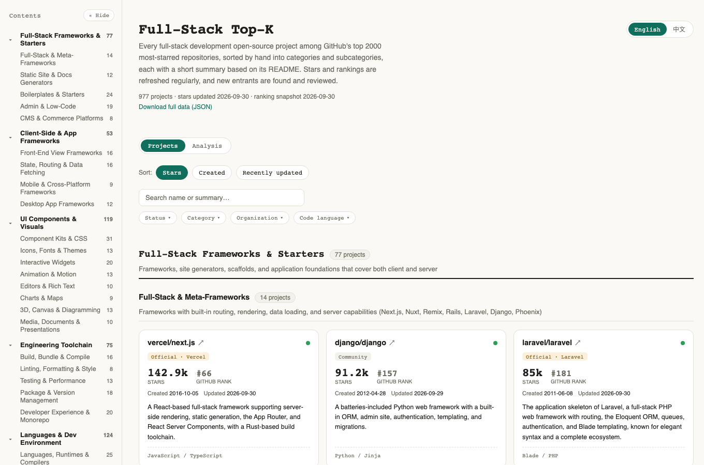
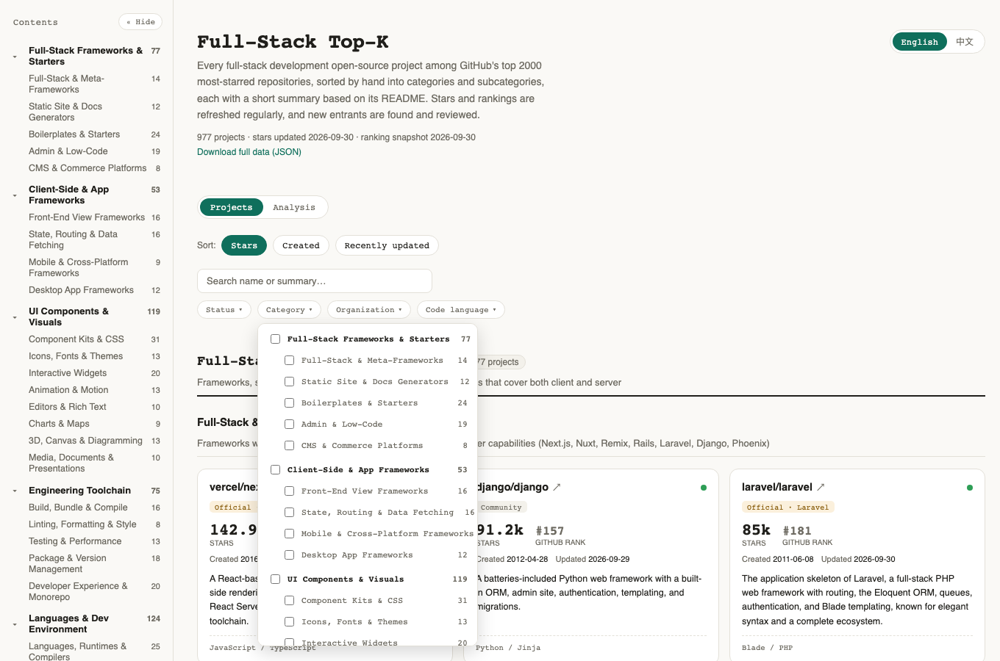
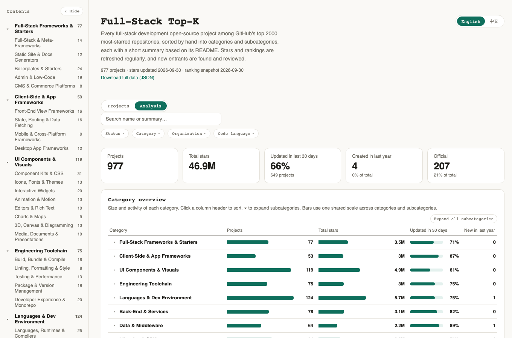

# Full-Stack Top-K

[](LICENSE)
[](data/LICENSE)

**English** | [中文](README.zh-CN.md)

A hand-curated map of every **full-stack development** open-source project among GitHub's top-K most-starred repositories (currently K = 2000): client side (web, mobile, desktop), server side, data, and delivery, plus learning resources. Each project is sorted into a two-level taxonomy, has a short summary written from its README, and carries its real GitHub-wide star rank. Rankings and stars are refreshed regularly, and new entrants are found and reviewed.

Sister project: [AI Top-K](https://github.com/sigangluo/github-ai-topk), the same pipeline applied to AI projects (machine learning, deep learning, LLMs, and agents). The two lists never overlap: `build.py` checks against the sister list (a sibling checkout if present, otherwise its published data on GitHub) and fails on any repo that appears in both.

**Live dashboard: <https://sigangluo.github.io/github-fullstack-topk/>**

[](https://sigangluo.github.io/github-fullstack-topk/)

## What you can do

- **Browse** hundreds of projects grouped into 11 categories and 60 subcategories, with a sidebar table of contents. Every subcategory has a written definition of what belongs in it.
- **See each project's real rank** among all GitHub repositories by stars, plus creation date, last push, main languages, and whether the repo is archived.
- **Filter** by category tree, organization, code language, official vs community, or activity, and search names and summaries.
- **Analyze** the landscape: category size and activity, new projects per quarter, language trends by creation year, official projects by company, and popular projects that went quiet.
- **Switch language**: the whole UI and every summary are available in English and 中文.
- **Reuse the data**: [`topk.json`](https://sigangluo.github.io/github-fullstack-topk/data/topk.json) has everything; [PROJECTS.md](PROJECTS.md) is a browsable list right on GitHub.

<table>
<tr>
<td width="50%"><br><sub>Two-level category filter</sub></td>
<td width="50%"><br><sub>Analysis view</sub></td>
</tr>
</table>

## Scope

The range is set by **rank** (top K by stars), not by taste. A human decides whether each repo is relevant; everything objective comes from the GitHub API.

- **Included**: what a developer uses to build, run, and ship software end to end: full-stack frameworks and starters, admin / low-code / headless CMS and commerce; client side (front-end frameworks, UI components, mobile / desktop / cross-platform frameworks, build tooling); server side (back-end frameworks, application languages and runtimes, API layers, databases and ORMs, messaging / search middleware, authentication, data processing and BI); delivery (containers and infrastructure as code, deployment platforms, CI/CD and self-hosted Git platforms, monitoring); the developer's own tools and foundations (editors and IDEs, the command line and terminal, CLI / TUI frameworks, C / C++ foundation libraries, compiler infrastructure); plus roadmaps, tutorials, system-design and interview material, design patterns and coding guidelines, algorithms and data structures, and awesome lists.
- **Excluded**: projects whose core is machine learning, deep learning, LLMs, or agents (they live in the sister list), games and game engines, blockchain, security and penetration tools, IoT and hardware, and end-user applications (media players, note-taking apps, proxy clients, desktop utilities) as opposed to tools developers use to build software. When unsure, it stays out.
- **Official vs community**: a repo is "official" only if its GitHub organization *is* the company itself. Foundations, community orgs, and projects handed over to the community count as "community".

The taxonomy, with a definition for each subcategory, is in [data/taxonomy.json](data/taxonomy.json).

## Repository layout

```
data/
├── taxonomy.json      two-level taxonomy (English + Chinese)           hand-maintained
├── projects.json      included projects: category, official, summaries  hand-maintained
├── ranking.json       top-K ranking snapshot                            scripts/rank.py
└── candidates.json    new entrants waiting for review                   scripts/candidates.py
scripts/               data pipeline, Python 3.9+ standard library only
site/                  static dashboard (plain HTML / CSS / JS, no build step)
PROJECTS.md            category list in English (PROJECTS.zh-CN.md in Chinese), generated by build.py
```

Each entry in `projects.json` has `category` (subcategory key), `official`, `officialOrg`, `summary` (Chinese), `summary_en` (English), and `added` (filled in automatically). Stars, creation date, languages, and rank are added by `build.py`, never written by hand.

## Updating the data

```bash
export GH_TOKEN=...                            # a token with no scopes is enough
python3 scripts/rank.py                        # refresh the top-K ranking (--k 3000 to widen it)
python3 scripts/candidates.py                  # list repos that need review (details in data/candidates.json)
# for relevant ones, add an entry to data/projects.json
python3 scripts/candidates.py --exclude-rest   # mark the rest as out of scope for good
python3 scripts/build.py                       # validate, fetch live stats, regenerate site data and the lists
```

`build.py --offline` regenerates from the previous live data when only categories or summaries changed.

## Run locally

```bash
python3 -m http.server -d site 8000            # the dashboard needs a static server; opening the HTML file directly can't load the data
```

Pushes that change `site/` deploy to GitHub Pages through `.github/workflows/deploy-pages.yml`. Set Settings → Pages → Source to "GitHub Actions".

## Contributing

This is a personally maintained project. **Pull requests are not accepted** and will be closed. Issues with feedback or suggestions are welcome, though there's no guarantee of a reply or of adoption. You're free to fork it and keep your own version under the licenses below.

## License

Code: [MIT](LICENSE). Data (`data/`, `PROJECTS*.md`, `site/data/`): [CC BY 4.0](data/LICENSE), please credit this project when you use it.
