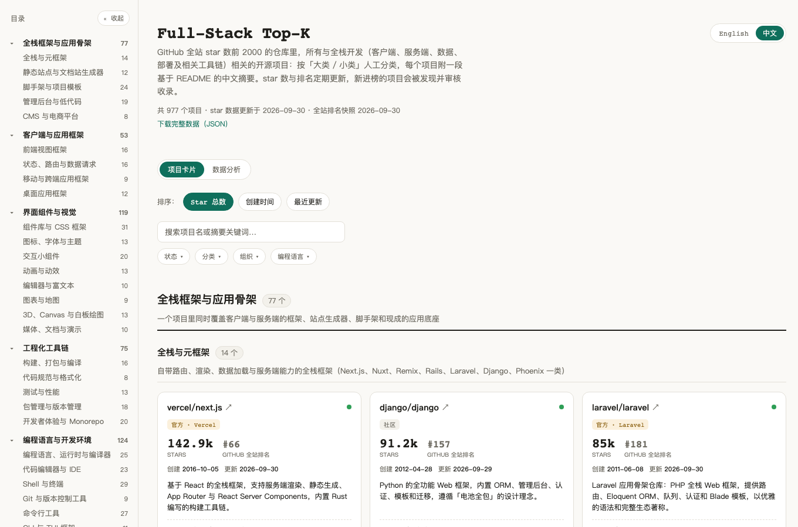
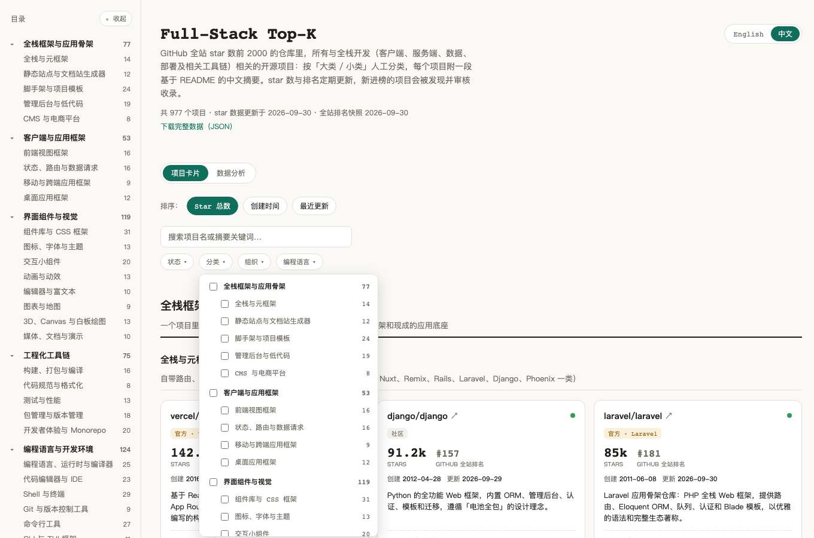
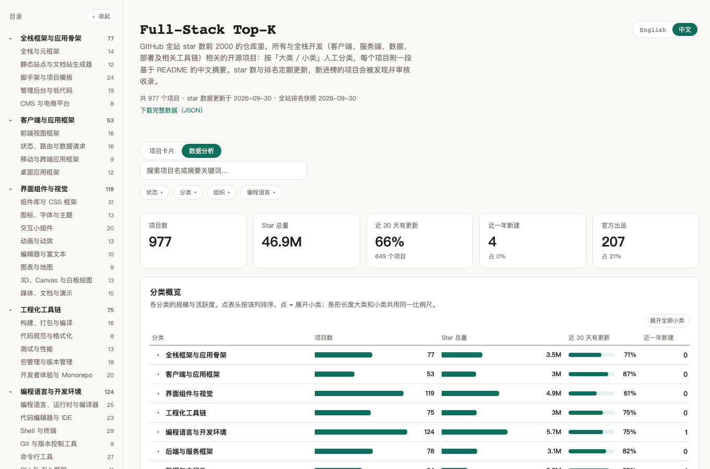

# Full-Stack Top-K

[](LICENSE)
[](data/LICENSE)

[English](README.md) | **中文**

GitHub 全站 star 排名前 K（当前 K = 2000）的仓库里，所有与**全栈开发**相关的开源项目，人工整理成一张图谱：客户端（网页、移动、桌面）、服务端、数据、交付部署，以及学习资源。两级分类、基于 README 撰写的中文摘要、真实的 GitHub 全站排名。排名和 star 数定期更新，新进榜的项目会被发现并审核。

姊妹项目：[AI Top-K](https://github.com/sigangluo/github-ai-topk)，同一套流程，方向是 AI（机器学习、深度学习、LLM 与 Agent）。两份列表互不重叠：`build.py` 会对照姊妹列表（优先用本地同级目录，没有就读它在 GitHub 上的线上数据），发现两边都收录的仓库会直接报错。

**在线看板：<https://sigangluo.github.io/github-fullstack-topk/>**

[](https://sigangluo.github.io/github-fullstack-topk/)

## 能做什么

- **浏览**：数百个项目按 11 个大类、60 个小类整理，带侧边目录；每个小类都写明了收录边界。
- **看排名**：每个项目都标出它在 GitHub 全站按 star 的真实名次，以及创建时间、最近推送、主要语言、是否已归档。
- **筛选**：按分类树、组织、编程语言、官方 / 社区、活跃度筛选，也可以搜索项目名和摘要。
- **分析**：各分类的规模与活跃度、每季度新建项目数、按创建年份看语言变化、各公司官方出品、高 star 但已经沉寂的项目。
- **切换语言**：整个界面和每一条摘要都有中文和 English 两个版本。
- **复用数据**：[`topk.json`](https://sigangluo.github.io/github-fullstack-topk/data/topk.json) 包含全部数据；[PROJECTS.zh-CN.md](PROJECTS.zh-CN.md) 是可直接在 GitHub 上浏览的清单。

<table>
<tr>
<td width="50%"><br><sub>两级分类筛选</sub></td>
<td width="50%"><br><sub>数据分析视图</sub></td>
</tr>
</table>

## 收录范围

范围由**排名**决定（前 K 名），而不是作者的口味；是否相关由人工逐个判断，客观数据全部由脚本从 GitHub 拉取。

- **收录**：开发者端到端构建、运行并发布软件所用到的项目——全栈框架与脚手架、管理后台 / 低代码 / 无头 CMS 与无头电商；客户端（前端框架、UI 组件、移动 / 桌面 / 跨端框架、构建工具链）；服务端（后端框架、应用开发语言与运行时、API 层、数据库与 ORM、消息 / 搜索中间件、认证、数据处理与 BI）；交付（容器与基础设施即代码、部署平台、CI/CD 与自托管 Git 平台、监控）；开发者自己的工具与底层基础（编辑器与 IDE、命令行与终端、CLI / TUI 框架、C / C++ 基础库、编译器基础设施）；以及路线图、教程、系统设计与面试资料、设计模式与编码规范、算法与数据结构和 Awesome 清单。
- **不收录**：核心是机器学习、深度学习、LLM 或 Agent 的项目（归姊妹列表）、游戏与游戏引擎、区块链、安全与渗透工具、物联网与硬件，以及终端用户应用（播放器、笔记软件、代理客户端、桌面工具等），也就是「给最终用户用」而不是「开发者拿来构建软件」的项目；拿不准的不收。
- **官方 / 社区**：仓库所在的 GitHub 组织就是该公司本身才算「官方」；基金会、社区组织、已移交社区维护的项目一律算「社区」。

分类体系和每个小类的边界定义见 [data/taxonomy.json](data/taxonomy.json)。

## 目录结构

```
data/
├── taxonomy.json      两级分类体系（中英双语）                       人工维护
├── projects.json      已收录项目：分类、官方/社区、双语摘要           人工维护
├── ranking.json       Top-K 排名快照                                 scripts/rank.py
└── candidates.json    待审核的新进榜仓库                             scripts/candidates.py
scripts/               数据流水线，只依赖 Python 3.9+ 标准库
site/                  静态看板（纯 HTML / CSS / JS，无需构建）
PROJECTS.zh-CN.md      中文清单（英文版 PROJECTS.md），由 build.py 生成
```

`projects.json` 里每条包含 `category`（小类 key）、`official`、`officialOrg`、`summary`（中文）、`summary_en`（英文）和 `added`（自动填写）。star 数、创建时间、语言、名次由 `build.py` 拉取，不手写。

## 更新数据

```bash
export GH_TOKEN=...                            # 不勾选任何权限的 token 即可
python3 scripts/rank.py                        # 刷新 Top-K 排名（--k 3000 可扩大范围）
python3 scripts/candidates.py                  # 列出待审核仓库（详情在 data/candidates.json）
# 相关的：在 data/projects.json 里加一条
python3 scripts/candidates.py --exclude-rest   # 其余标记为不收录，以后不再出现
python3 scripts/build.py                       # 校验、拉取实时数据、重新生成站点数据和清单
```

只改了分类或摘要、不想联网：`build.py --offline`。

## 本地预览与部署

```bash
python3 -m http.server -d site 8000            # 看板需要静态服务器，双击打开 HTML 读不到数据
```

`site/` 有改动推送到 main 时，`.github/workflows/deploy-pages.yml` 自动发布到 GitHub Pages，需在 Settings → Pages → Source 选「GitHub Actions」。

## 关于贡献

本项目由维护者个人维护，**不接受 Pull Request**（会直接关闭）。欢迎通过 issue 反馈问题或提出建议，但不保证回复和采纳。你也可以在遵守下方许可证的前提下自由 fork，按自己的口径维护一份。

## 许可证

代码 [MIT](LICENSE)；数据（`data/`、`PROJECTS*.md`、`site/data/`）[CC BY 4.0](data/LICENSE)，使用请注明来源。
